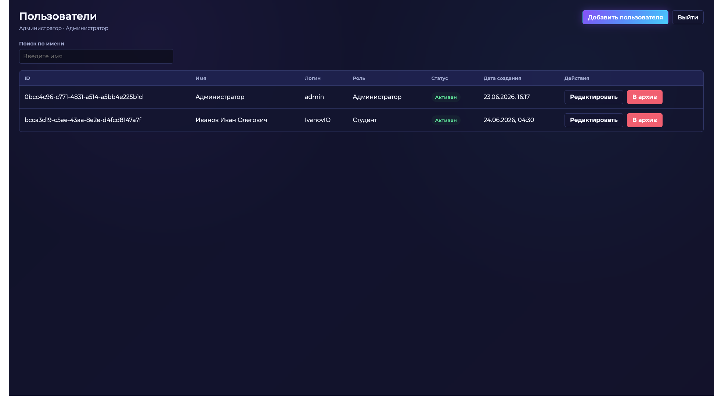
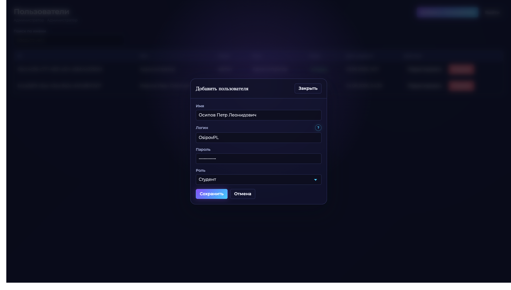
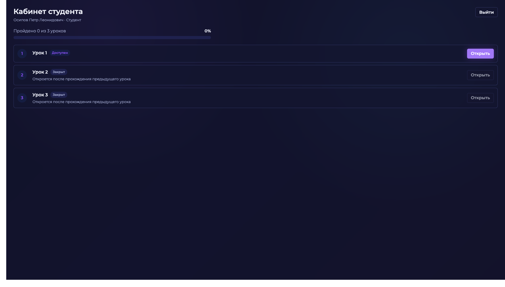
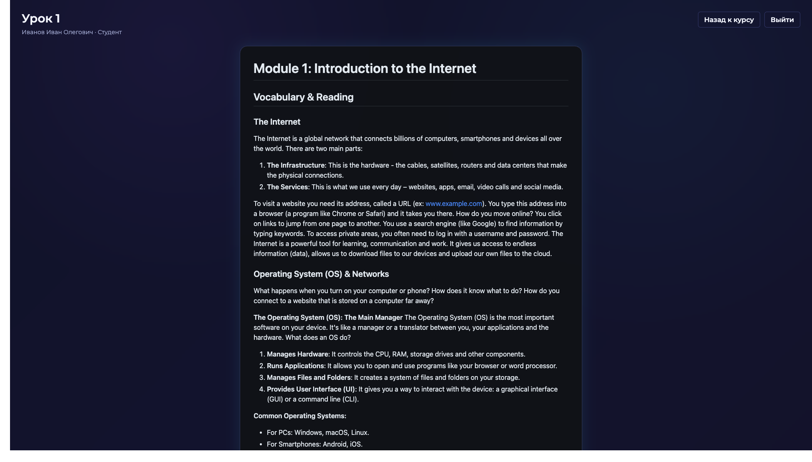
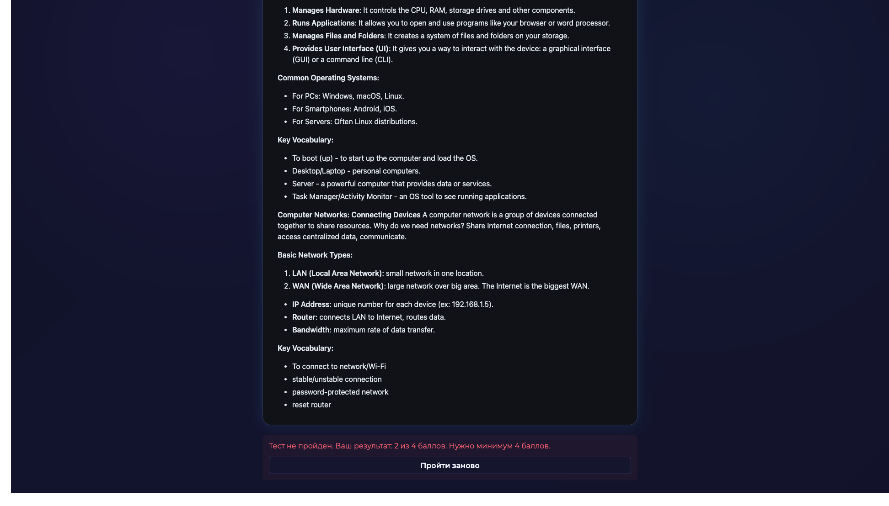
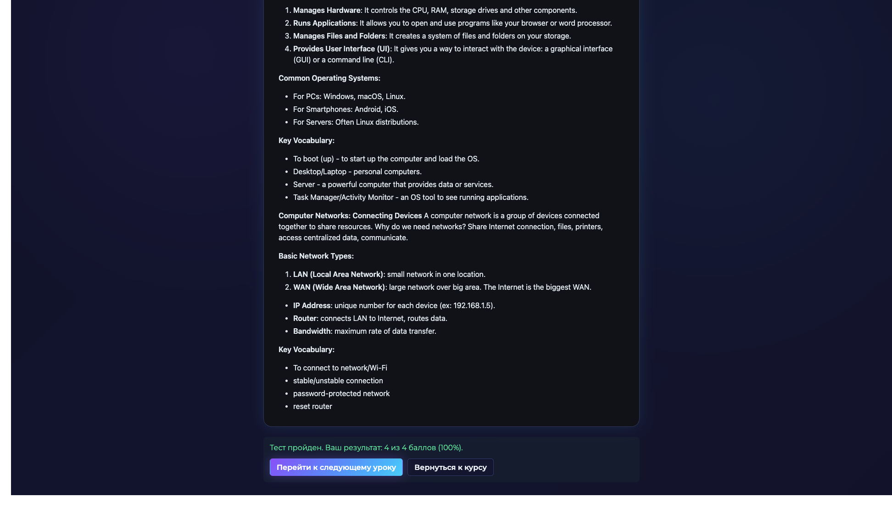
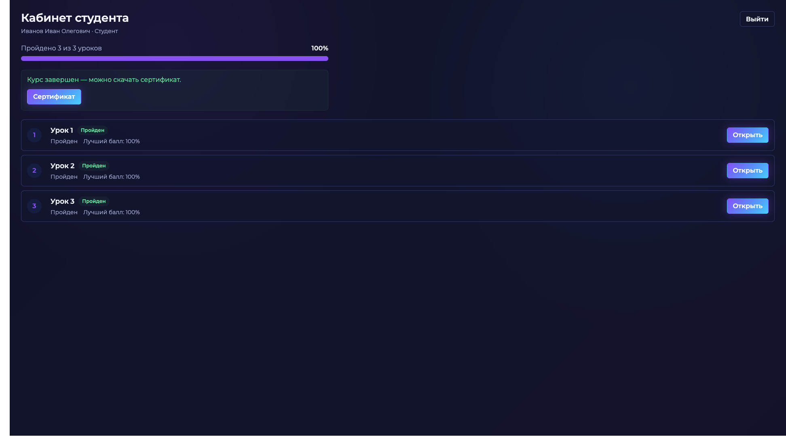
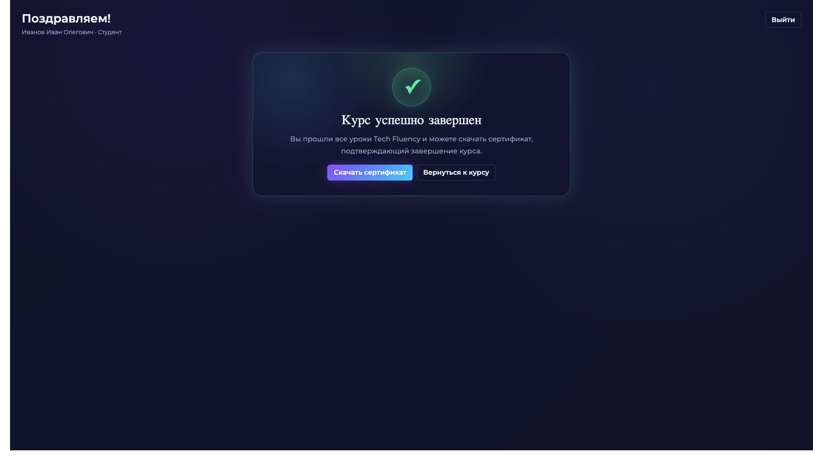
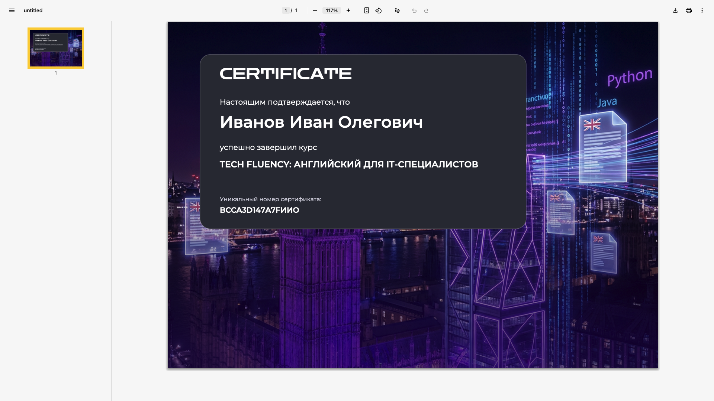

## 1. Общая платформа

## 2. Админка: список пользователей

## 3. Админка: добавление пользователя

## 4. Кабинет студента: старт курса

## 5. Урок: Markdown-контент

## 6. Тест: неуспешная попытка

## 7. Тест: успешная попытка

## 8. Кабинет студента: курс завершен

## 9. Финальная страница курса

## 10. Сертификат

